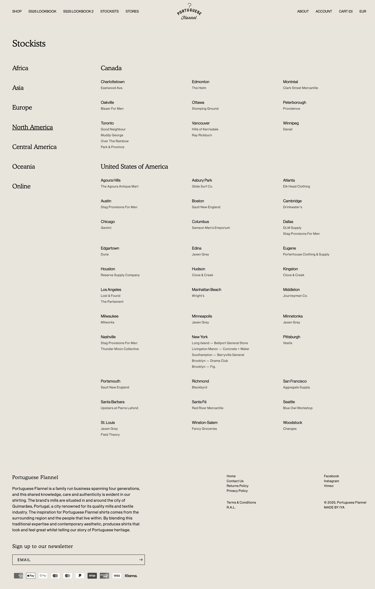
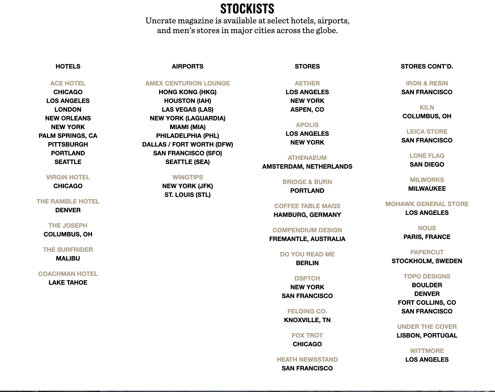
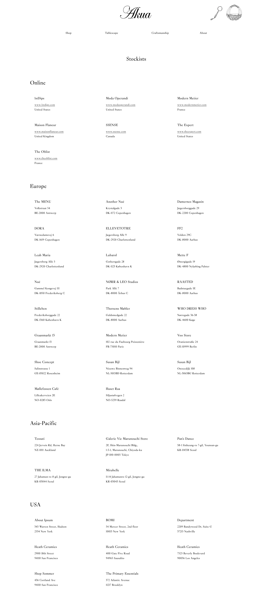
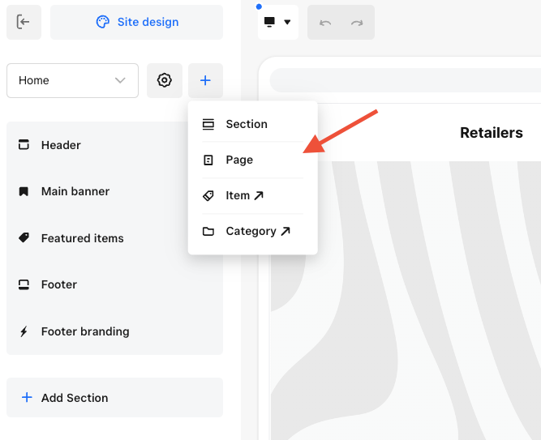
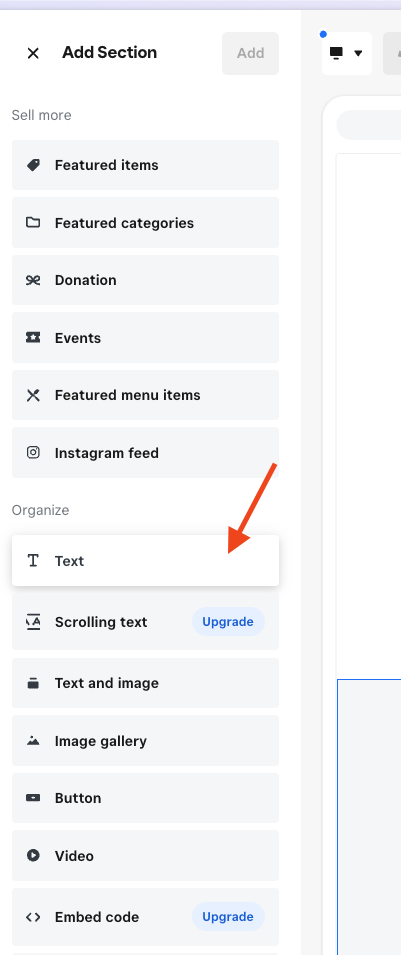
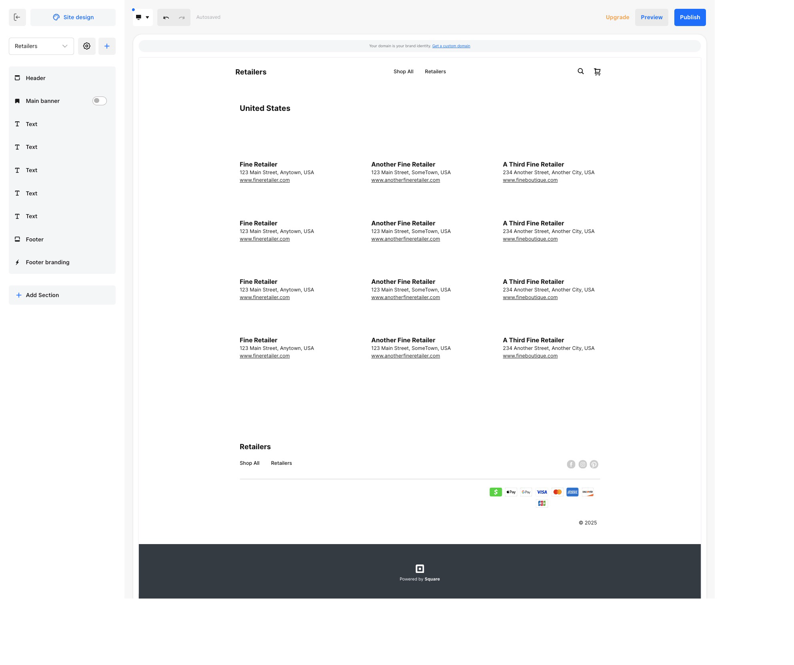

If you're a Square seller who wholesales products, you might be considering using a third-party store locator to help customers find your retailers. Don't. Unless you're working with hundreds or thousands of retail partners, you're over-complicating your life. First, Square doesn't let you embed the third party code on the website unless you are on at least the Square Plus plan($29). Second, the store mapping services services have a little secret. **They don't provide the map**. You have to bring your own by getting an account at a mapping service like Google Maps or MapBox. So you will be paying the **mapless store mapper** and have to keep tabs to make sure you don't go over the free tier of Google Maps or MapBox. Third, you can do what other high-end boutique brand do, have a simple page that lists your retailers.

## What You're Really Paying For (And What You're Not)

When you sign up for services like Stockist, StoreMapper, or similar platforms, you're essentially paying for a database and search interface. The interactive map that makes these services appealing? They don't provide that. Most  sellers discover this hidden cost after they've signed up and put in their credit card.

Google Maps API and MapBox have generous free tiers but if you have spike in traffic (say during holiday shopping season) suddenly your $29/month store locator becomes a $79-150/month expense when you factor in mapping costs and the required Square Plus upgrade.

## Why Most Wholesale Sellers Don't Need This Complexity

The fundamental question is whether you're solving a real problem or creating new ones. Store locators excel when you have:

- Hundreds of retail locations
- Frequently changing store information
- Customers who need to filter by specific criteria (hours, services, inventory)
- National or international distribution requiring geographic search

Most Square  sellers work with 10-50 retail partners whose information rarely changes. The boutique in Portland isn't moving locations monthly, and your customers don't need to filter by "stores open past 9 PM" when you have twelve retail partners total.

## The Simple Page Approach That Actually Works

High-end boutique brands have figured this out. They use clean, well-organized pages that give customers exactly what they need without the technical overhead.

**Portuguese Flannel** organizes their [stores page](https://www.portugueseflannel.com/pages/stores) by region. Customers can quickly scan for their area without needing to interact with maps or search functions. It's fast, mobile-friendly, and provides all necessary information at a glance.

**Uncrate Magazine** takes an interesting approach on their [stockists page](https://uncrate.com/magazine/#magazine-stockists), categorizing locations beyond traditional retail—airports, hotels, and specialty venues. This shows how a simple format can accommodate unique distribution strategies that a standard store locator template might not handle well.

**Akua Objects** demonstrates scale with their [stockists page](https://akuaobjects.com/en-us/blogs/campaign/stockists) featuring over 40 retailers broken up by r Even with this many partners, the simple list format remains more useful than a crowded map interface. Customers can quickly scan for familiar store names or cities without waiting for map tiles to load.

The pattern across successful brands is clear: provide essential information in a scannable format. Store name, location, and contact details. Nothing more complex than necessary.

## Building Your Retailer Page in Square Online

Creating an effective retailer page takes about an hour of focused work:

1. **Navigate to your Site Editor** in your Square Online dashboard
2. **Add a new page** using the + button and give it a clear name like "Where to Buy" or "Stockists" 
3. **Create your first section** and add a text block for your first retailer

For each retailer, include:
- Store name
- Full address (this helps with local SEO too)
- Phone number
- Website or social media if relevant
- Brief note about what products they carry (if you have different product lines)

**Time-saving tip:** Build your first retailer entry completely, then use Square's duplicate function to copy the formatting. You'll only need to swap out the specific details for each additional location, maintaining consistent styling across your entire page.

Consider organizing by geographic region if you have retailers across multiple states or countries. This makes it easier for customers to find relevant locations quickly.

## Keep Your Solution Sustainable

The best business solutions are the ones you can maintain long-term without ongoing complexity. A simple retailer page requires minimal updates when partners change, costs nothing beyond your existing Square Online plan, and won't break when third-party services update their APIs or change their pricing.

Your customers want to know where they can buy your products. They don't need interactive maps, search filters, or dynamic content for a manageable list of retail partners. Give them clean, organized information and they'll find what they need.

Store mapping services solve enterprise problems with enterprise complexity and enterprise costs. Most wholesale sellers have directory problems that need directory solutions.

---

*If your wholesale business has grown to hundreds of retail partners and you do need more sophisticated location management, I'll cover how to evaluate and implement store mapping services while avoiding the extra mapping fees.*

